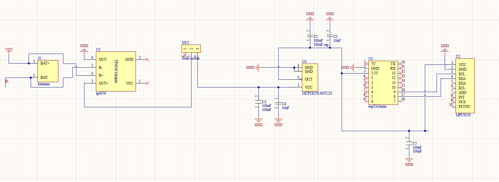
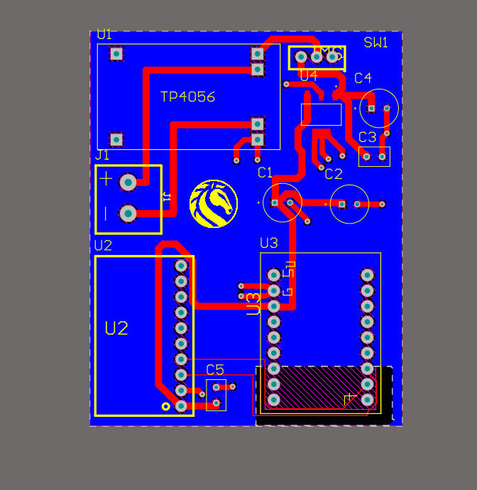
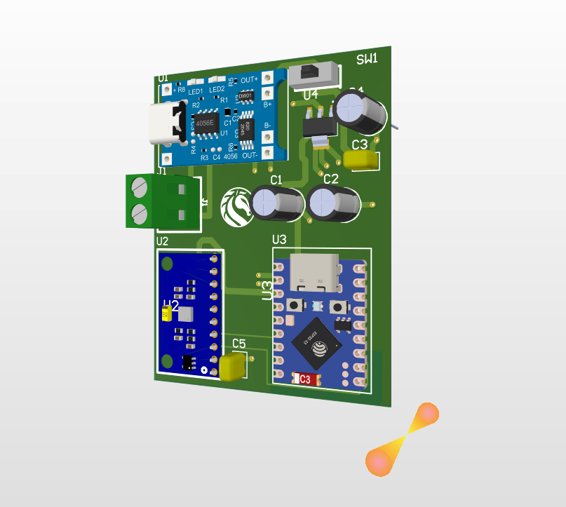

# ESP32-S3 Wireless Head Tracker

Low-power WiFi head tracker firmware for ESP32-S3 Mini + MPU9xxx-style IMU modules, designed for OpenTrack and sim games such as Euro Truck Simulator 2 and Assetto Corsa.

The current tested sensor module behaves as a 6-axis MPU6500-compatible board. The firmware can probe/use an AK8963 magnetometer when a real MPU9250-compatible module exposes it, but gyro-only yaw will still drift slowly without a working magnetometer or another absolute yaw reference.

## Features

- ESP32-S3 Mini firmware for Arduino IDE / Arduino CLI
- MPU IMU over I2C at 400 kHz
- 125 Hz sensor sampling
- 60 Hz OpenTrack UDP output
- Startup gyro calibration from current still position
- Runtime recenter and gyro recalibration commands over serial
- Low TX power WiFi mode for lower heat
- Diagnostic sketch for MPU9250 / AK8963 magnetometer probing
- PC-side UDP listener tools for debugging

## Hardware

Custom PCB: TP4056 handles LiPo charging, an MCP1825S-SOT223 LDO regulates
3.3 V for the ESP32-S3 Mini and the IMU, and a slide switch gates the battery
line. Altium source is in [`hardware/altium/`](hardware/altium/); notes on
the tested wiring, axis mapping and power budget are in
[`docs/HARDWARE.md`](docs/HARDWARE.md).

| Component | Role |
|---|---|
| ESP32-S3 Mini | MCU, WiFi, runs the firmware |
| MPU9250 / MPU6500-compatible IMU | Motion sensing over I2C |
| TP4056 module | LiPo charge controller (USB input) |
| MCP1825S-SOT223 | 3.3 V LDO for the ESP32 + IMU rail |
| 1S LiPo battery | Power source |
| Slide switch | Power on/off |

| Schematic | 3D view | Routed layout |
|---|---|---|
|  |  |  |

## Repository Layout

```text
firmware/headtracker_udp_lowpower/        Main firmware
firmware/diagnostics/mpu9250_deep_probe/ Deep MPU9250/AK8963 probe sketch
hardware/altium/                         Altium project (schematic, PCB, libraries)
tools/                                   PC-side debug tools
docs/                                    Setup, hardware and troubleshooting notes
```

## Quick Start

1. Open `firmware/headtracker_udp_lowpower/headtracker_udp_lowpower.ino` in Arduino IDE.
2. Copy `secrets.example.h` to `secrets.h` in the same folder.
3. Fill WiFi SSID, WiFi password, and the PC IPv4 address running OpenTrack.
4. Select the ESP32-S3 Mini board. The tested Arduino CLI FQBN is:

```powershell
esp32:esp32:lolin_s3_mini:CDCOnBoot=cdc
```

5. Upload the sketch.
6. Keep the tracker completely still during startup calibration.
7. In OpenTrack, use UDP input on port `4242`.

## Serial Commands

Send these from Arduino Serial Monitor:

```text
c  recenter current pose
b  recalibrate gyro bias and recenter; keep sensor still
m  toggle magnetometer yaw correction
s  scan I2C bus
h  print help
```

## OpenTrack Packet

The firmware sends one UDP packet containing six little-endian `double` values:

```text
tx, ty, tz, yaw_deg, pitch_deg, roll_deg
```

Only rotational axes are used. Roll is currently sent as `0` by default because the in-game setup was tuned with roll disabled.

## Important Notes

- Do not commit `secrets.h`; it contains WiFi credentials.
- If OpenTrack stops seeing the tracker after days/weeks, the PC IP probably changed. Update `HEADTRACKER_OPENTRACK_PC_IP` in `secrets.h`, or reserve a fixed DHCP address for the PC in the router.
- For real yaw drift correction, use a module with a working magnetometer or add an external magnetometer on the I2C bus.
- A real MPU9250/AK8963 setup should show `0x68` and `0x0C` in the I2C scan, with AK8963 `WHO_AM_I = 0x48`.

## Demo

[](https://youtube.com/shorts/CIPEAHezTM8)

The tracker responding to head movement in real time, hand-held for clarity.
This clip is running on an earlier perfboard prototype rather than the PCB
shown above; the wiring is the same as the schematic.

## Status

PCB designed and firmware validated on the bench (prototype hardware); a
populated version of the board above and an enclosure are the next steps.

## License

MIT — see [LICENSE](LICENSE).
